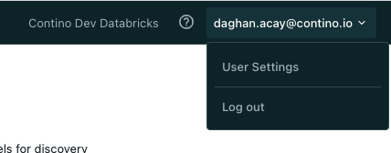
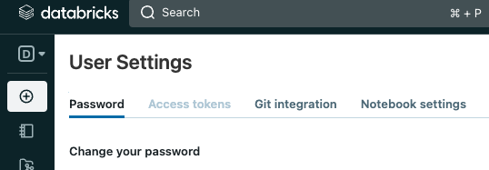

# Requirements

- Pipenv: pip install pipenv
- jq:  brew install jq

# Instalation

Starts pipenv shell and check if you have the installation is sucessful
- pipenv shell
- databricks -version

Chekcout repo into your databrivks environment as well.

# Set up Authentication

databricks configure --token

- Enter your workspace URL, with the format https://"instance-name".cloud.databricks.com

- Get your Access token by selecting user

- Once the CLI is set up then you can see the configuration files at ~/.databrickscfg
[DEFAULT]
host = <workspace-URL>
token = <personal-access-token>

WARNING: thisis not the recomended way. Alternatively you can use your username and password in that case write the following to ~/.databrickscfg
[DEFAULT]
host = <workspace-URL>
username = <username>
password = <password>

See if you get the access correct by running 
 - databricks workspace ls /Users/[your user name e.g. daghan.acay.contino.io]

 # Help on CLI

 you can sue help at every level e.g.

 databricks -h
 databricks fs -h
 databricks fs ls -h

 find job settigns using jq

 databricks jobs list --output JSON | jq '.jobs[] |  .settings'

 get list of clusters 

 databricks clusters list --output JSON | jq '[ .clusters[] | { name: .cluster_name, id: .cluster_id } ]'

 # Creating an running a job

 Create a job in the databricks. You need to change the follwing entries in the jobs.json:

 - notebook_path: user id e.g. daghan.acay@contino.io should be replaced by your user id
 - existing_cluster_id: should be set to an exisitng generic cluster id 

 databricks jobs create --json-file databricks/jobs/jobs.json

 You will get the job_id as an output. You can also find job id as follows

 databricks jobs list | grep "Example Job CLI"

 or you can alsways check from the databricks workspace 

 you can run your job using command 

databricks jobs run-now --job-id [your job id]

and finally delete the job

databricks jobs delete --job-id [your job id]