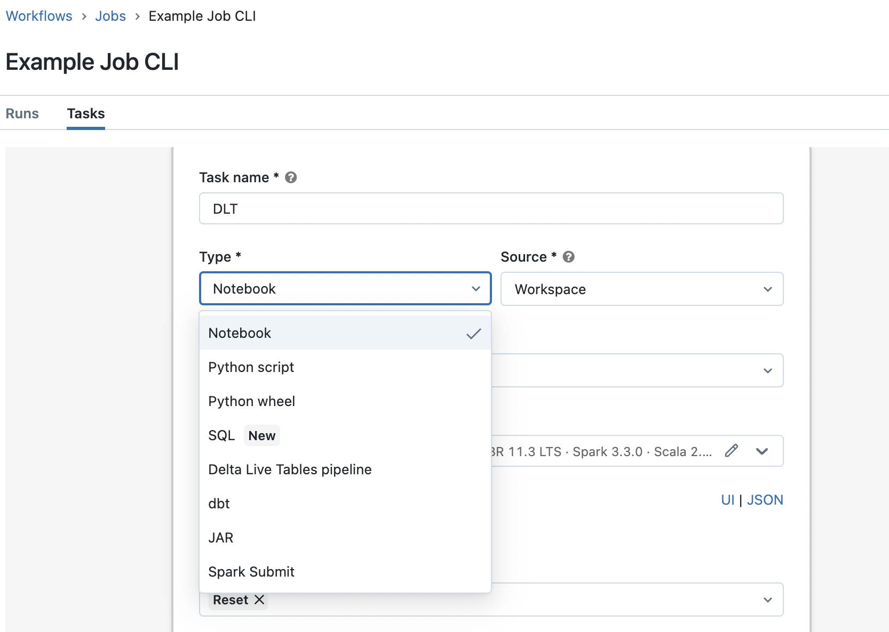

# Requirements

- Pipenv: pip install pipenv
- jq:  brew install jq

# Instalation

Install requirements:

- $ pipenv install

Starts pipenv shell and check if you have the installation is sucessful
- $ pipenv shell
- $ databricks -version

Checkout repo into your databricks environment as well.

# Set up Authentication

## Use personal token

- Enter your workspace URL, with the format https://"instance-name".cloud.databricks.com
- Get your Access token by selecting user


- Once the CLI is set up then you can see the configuration files at ~/.databrickscfg

```
[DEFAULT]
host = <workspace-URL>
token = <personal-access-token>
```

## Use username and password

WARNING: This is not the recomended but can be used if you do not have permission to generate personal token. 

You can use your username and password in that case create ~/.databrickscfg file manually and add the deatils as follows

```
[DEFAULT]
host = <workspace-URL>
username = <username>
password = <password>
````

See if you get the access correct by running 
 
 - databricks workspace ls

 # Help on CLI

 you can use help at every level e.g.

 - $ databricks -h
 - $ databricks fs -h
 - $ databricks fs ls -h

 You cana also use "jq" to get the specific part of the json data. For example, you can find find job settigns using jq

 - $ databricks jobs list --output JSON | jq '.jobs[].settings'

 or get the list of clusters 

 - $ databricks clusters list --output JSON | jq '[ .clusters[] | { name: .cluster_name, id: .cluster_id } ]'

 Next we will look into creating jobs from command line using CLI.

 # Creating an running a job

 First we will create a job in the databricks. You need to change the following entries in the jobs.json:

 - notebook_path: user id e.g. daghan.acay@contino.io should be replaced by your user id
 - existing_cluster_id: should be set to an exisitng generic cluster id 

 you can create the job and "Reset" task using the following comment

 - $ databricks jobs create --json-file databricks/jobs/jobs.json

 You will get the job_id as an output. You can also find job id as follows

 - $ databricks jobs list | grep "Example Job CLI"

 or you can alsways check from the databricks workspace 


 you can run your job using command 

- $ databricks jobs run-now --job-id [your job id]

# Add DLT to your job

First we will start creating a DLT pipeline. Before you run it, you need to change the following entires in the DLT.json

- target: look at the job run from the previous section. in the task run logs you will find "Creating & using the schema "[your id here]_delp_jobs_demo"...(0 seconds)". replace the "target" in DLT.json with the value from the logs
- path: user id e.g. daghan.acay@contino.io should be replaced by your user id
- storage: user id e.g. daghan.acay@contino.io should be replaced by your user id

you can create the DLT pipeline and the reset task using the following comment

- $ databricks pipelines create --settings databricks/jobs/DLT.json

You will get the job_id as an output. You can also find pipeline id as follows

- $ databricks pipelines list | jq '.[] | select(.name=="DLT CLI").pipeline_id'

Or you can find it from the databricks workspace


you can find the data used for the DLT pipeline using the "fs" CLI

- $ databricks fs ls dbfs:/mnt/dbacademy-datasets/data-engineer-learning-path/v01

Now you are ready to create a new job which contains the original "Rest" task and the DLT job we have just created. Before you do that you need to make the following changes in the CompositeJob.json

- notebook_path: user id e.g. daghan.acay@contino.io should be replaced by your user id
- existing_cluster_id: should be set to an exisitng generic cluster id 
- pipeline_id: DLT pipline id from above

You can create the new composite job by running the cli command below:

$ databricks jobs create --json-file databricks/jobs/CompositeJob.json

You can run the coposite job as follows

- $ databricks jobs run-now --job-id [your job id]

# Results of the composite job

Please go back to your databricks console and open the Repos/

# Other languages that can be added to Jobs

see 



# Cleaning up

and finally delete the job

databricks jobs delete --job-id [your job id]

and delete DLT pipeline

databricks pipelines delete --pipeline-id  [your DLT pipeline ID]